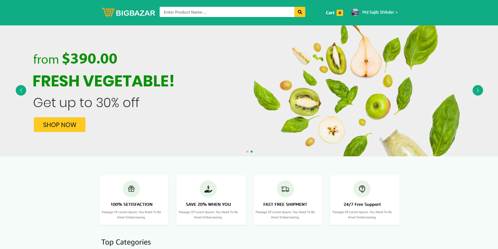

## Live Preview

```console
 https://shophub.live
```
**Admin Access**
```console
   email : sajibshikder78971@gmail.com
   password : 12345678
```

**User Access**
```console
   email : expert43developer5@gmail.com
   password : 12345678
```

## Installation or Download Project

Open Terminal (Git Bash)

```console
 git clone https://github.com/DEVELOPERxSAJIB/Bigbazar-ecommerce.git
```

## Quick Start

The quickest way to get started with this ecommerce is in details here

 **Install dependencies or Node_modules then Run Client or frontend  :**

```console
 cd client/
 npm install
 npm run dev
```

 **Run API Server or Backend :**

```console
 npm install
 npm start
```

Finishing this commands will run the application in your machine as Development mode. View the website at: http://localhost:3000

## After open in browser
***Login as Admin***

```console
   Id : sajibshikder78971@gmail.com
   password : 12345678
```
Gain administrative control and access to the application's dashboard with this feature. Enjoy the ability to update data, track order details, delete products, manage product reviews, and perform various other administrative tasks. This functionality enhances your control and management capabilities within the application.

***Also create your own account***
```console
   http://localhost:3000/register
```
Visit this url so you can Register as new user and enjoy the features

***Rather 
You can also revover password by just putting the email address.*** 
+ Select product for cart
+ Go to Cart page and checkout
+ Provide your shipping information
+ Make your payment complete
+ Track your order from your profile
+ Update your profile info with photo

And much more features are available in the full application. You can explore more by yourself


**For additional information, feel free to reach out to me on LinkedIn. Visit my LinkedIn profile [here](https://www.linkedin.com/in/mdsajibshikder/) for further discussions and inquiries.**
